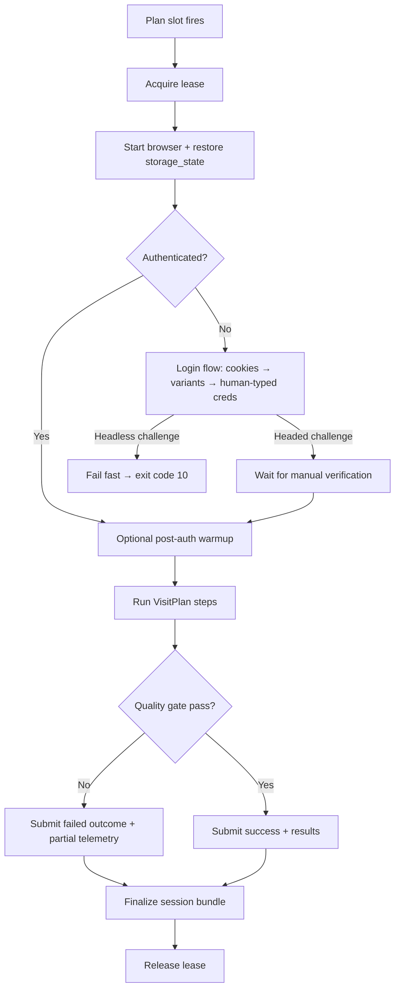
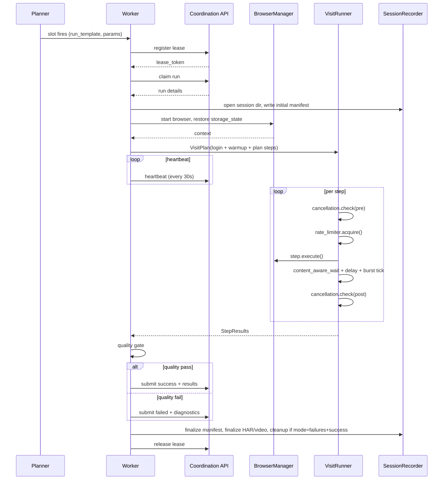

# Gentle Site Visitor — Architecture and Design

> **Status:** v0 design draft. No implementation yet.
> **Audience:** future maintainers and AI coding agents building applications on top of this skeleton.
> **Sources:** distilled from the CareerExplorer codebase (`src/scraper/browser.py`, `src/scraper/auth.py`, `src/sessions.py`, `src/worker.py`, `src/orchestrator_plan.py`, `src/config.py`, `docs/LINKEDIN.md`, `docs/ARCHITECTURE.md`). See [notes/_findings.md](../notes/_findings.md) for raw extraction notes.

---

## 1. Purpose

Gentle Site Visitor is a **reusable skeleton** for building applications that visit websites in a way that resembles a real, attentive human:

- Authenticated, persisted browser sessions
- Aligned fingerprint (Chromium build, UA, locale, timezone, viewport)
- Human-cadence interaction (delays, mouse pathing, click jitter, scrolling, dwell, distraction sleeps)
- Macro-pacing (hourly request caps, burst cooldowns, daily activity windows, rest periods between visits)
- Operationally correct under load (lease-based concurrency, cooperative cancellation, structured observability)
- Defensible quality gates that refuse to submit obviously bad data

The skeleton is **not a stealth/evasion toolkit.** It is a *gentle visit toolkit*: the user is real, the browser is real, the cadence is real. The goal is to be a polite, low-impact visitor — not to look like one while behaving badly.

### What this enables

Applications that compose on top of this skeleton can:

- Log into a site once and reuse the session for days
- Run scheduled, jittered visits inside a daily activity window
- Walk a site's pages while honoring per-action delays, scrolling, mouse moves, and burst cooldowns
- Capture full Playwright trace + HAR + video for any failed visit, for forensic replay
- Cancel running visits cooperatively and drain partial results
- Recover from session expiry with auto re-login plus 2FA escalation
- Scale to multiple workers without claim races (lease-based)

### What it explicitly does NOT do

- It does **not** patch every detection vector (Canvas / WebGL / WebRTC / TLS fingerprint). The premise is that with a real Chromium binary + residential network + human pacing, that level of spoofing is unnecessary.
- It does **not** rotate proxies or IP addresses. The deployment expects to run from a residential connection (e.g., a home NUC, a personal workstation).
- It does **not** solve CAPTCHAs. It escalates to manual completion in headed mode.
- It does **not** parallelize within a single site session. A session is a single browsing identity at a time.

---

## 2. Design principles

These are the load-bearing decisions, in priority order. Every layer below should be traceable to one of these.

1. **Be a polite visitor, not a stealthy intruder.** Real Chromium, residential IP, paced behavior. Optimize for "would a human reviewer find this traffic surprising?" being answered "no."
2. **Layered defense in depth.** Network, fingerprint, behavior, pacing, session, quality. Each layer is independently weak; the combination is what looks human.
3. **Cooperate with the site, not just with the law.** Stop at known platform pagination caps. Skip duplicates before re-visiting. Do not retry hot when a checkpoint appears.
4. **Refuse to submit bad data.** A quality gate at run boundaries means a broken selector fails a run, not poisons the dataset.
5. **Every run is replayable.** Each run produces a self-contained session bundle (`manifest.json` + optional `trace.zip`, `network.har`, `video.webm`, `<probe>.jsonl`). Failures are debuggable from artifacts, not from rerunning live.
6. **Cancellation is cooperative, not violent.** Cancel signals reach the worker at named "boundaries" between phases; the worker drains partial results and acknowledges. Never `kill -9`.
7. **Site-specific knowledge stays in site adapters.** Selectors, URL conventions, login form variants, platform caps — all isolated. The core never imports from a site adapter.
8. **Configuration is declarative and overridable per site.** A single base config defines defaults; per-site overrides specialize.
9. **Conservative defaults.** Out of the box, the skeleton runs at a polite cadence (≤ 90 requests/hour, 2-5s per action, occasional 15-45s distractions, hourly burst cooldowns) and minimum observability ("failures" mode). Faster cadence and richer observability are explicit opt-ins.
10. **No hidden recon.** Any feature that issues extra requests beyond the visit's nominal path is off by default and capped (e.g., integrity audits, link probes).

---

## 3. System overview

```
┌─────────────────────────────────────────────────────────────────────┐
│                         Application layer                           │
│                  (one app = one site adapter)                       │
│                                                                     │
│  apps/<app>/                  apps/<another-app>/                   │
│   ├── visit_steps.py            ├── visit_steps.py                  │
│   ├── selectors.py              ├── selectors.py                    │
│   ├── login.py (specializes)    ├── login.py                        │
│   └── config.yaml               └── config.yaml                     │
└────────────────────────────┬────────────────────────────────────────┘
                             │
┌────────────────────────────▼────────────────────────────────────────┐
│                          Visit layer                                │
│      VisitPlan • VisitStep • VisitContext • Boundary checkpoints    │
│      (orchestrates fetch → wait → interact → extract → dwell)       │
└────────────────────────────┬────────────────────────────────────────┘
                             │
┌────────────────────────────▼────────────────────────────────────────┐
│                       Pacing & realism                              │
│  DelayProfile • BurstGovernor • ContentAwareWait                    │
│  random_delay • human_delay • mouse pathing • jitter click • dwell  │
│  type cadence • RateLimiter (per-hour)                              │
└────────────────────────────┬────────────────────────────────────────┘
                             │
┌────────────────────────────▼────────────────────────────────────────┐
│                      Browser & session                              │
│  BrowserManager (Chromium launch, fingerprint, viewport, UA)        │
│  Session (storage_state load/save, auth flow, warmup, re-login)     │
│  ChallengePolicy (manual headed escalation, headless fail-fast)     │
└────────────────────────────┬────────────────────────────────────────┘
                             │
┌────────────────────────────▼────────────────────────────────────────┐
│                      Run / lease / cancel                           │
│  RunController (claim → heartbeat → execute → submit → release)     │
│  LeaseClient • CancellationMonitor • ExitCodes                      │
└────────────────────────────┬────────────────────────────────────────┘
                             │
┌────────────────────────────▼────────────────────────────────────────┐
│                  Scheduling & observability                         │
│  Planner (activity window, jitter, rest periods)                    │
│  SessionRecorder (trace/HAR/video) • SessionStore (CLI, retention)  │
└─────────────────────────────────────────────────────────────────────┘
```

### High-level flow of a single visit



Inside step `G`, every step boundary is a cancellation checkpoint and a possible burst-cooldown trigger.

---

## 4. Layered design

### 4.1 Browser & fingerprint layer (`gsv.browser`)

**Responsibility:** create and own the Playwright browser/context; provide low-level human-like interaction primitives; persist storage state.

**Key primitives** (taken near-verbatim from CareerExplorer):

- `STEALTH_LAUNCH_ARGS`: `--disable-blink-features=AutomationControlled`, `--no-first-run`, `--no-default-browser-check`, `--disable-component-update`.
- `WEBDRIVER_INIT_SCRIPT`: defines `navigator.webdriver` as `undefined` via `add_init_script`.
- Dynamic user-agent: parse `browser.version` and emit a UA aligned to the actual installed Chromium build (no stale static UA strings).
- Random viewport per session (default 1260-1380 × 780-900) — configurable.
- Configurable `locale` and `timezone_id` — **default to UTC + en-US** in the skeleton; site adapters override.
- `RateLimiter` — sliding-window per-hour cap. Awaits when full.
- `random_delay(min, max)` — uniform sleep.
- `human_delay(min, max, distraction_chance, distraction_min, distraction_max)` — same with ~10% chance of a long "distraction" sleep (15-45s default).
- `random_mouse_move(page)` — moves to a random in-viewport position with `steps=5..15`, padded inside the viewport.
- `click_with_position_jitter(page, selector)` — clicks at a uniform 30-70% jittered position inside the element bounding box, with mouse pathing (`steps=4..12`); falls back to `page.click()` on failure.
- `run_humanized_page_dwell(page, min_seconds, max_seconds)` — splits a 7-10s budget into down-scroll / up-scroll phases with random magnitudes (140-420 / 100-300 px) and intra-phase delays.
- `human_type(page, selector, text)` — mouse-move → jitter-click → empty fill → per-char `type` with `delay=50-150ms` → trailing 0.3-0.8s pause.
- `scroll_page(page, times)` — full-viewport scrolls with mouse moves.

**Context creation kwargs** (canonical bundle):

```python
{
    "storage_state": <path|None>,
    "viewport": <random per-session>,
    "locale": <config>,
    "timezone_id": <config>,
    "user_agent": <dynamic>,
    # opt-in observability:
    "record_har_path": <session>/network.har,
    "record_har_url_filter": <allowed-host glob from site adapter>,
    "record_har_content": "omit" | "embed",
    "record_video_dir": <session>/videos,
    "record_video_size": {"width": 1280, "height": 800},
}
```

**Init scripts run on every context:** `WEBDRIVER_INIT_SCRIPT`. Sites may register additional init scripts via the adapter (e.g., spoofing `navigator.languages` to match `locale`).

**Important quirk inherited from CareerExplorer:** HAR and video options must be set at context creation. To enable mid-run, the framework must save `storage_state`, close the context, and reopen it with recording enabled. `BrowserManager.enable_har_for_session()` codifies this. We keep the same approach.

**Generalizations from CareerExplorer:**

- `record_har_url_filter` was hard-coded to LinkedIn. In the skeleton it comes from the site adapter's `allowed_host_globs` setting.
- Default locale/timezone in CareerExplorer were Spain. In the skeleton they default to UTC/en-US; sites override.
- Viewport range is configurable presets, not magic numbers.

### 4.2 Session & auth layer (`gsv.session`)

**Responsibility:** restore-or-login an authenticated browser session; persist `storage_state`; warmup; detect expiry; escalate verification challenges.

**Generic state machine** (extracted from `LinkedInSession`):

```
start()
 ├── BrowserManager.start() (loads storage_state if present)
 └── _check_authenticated():
        navigate to <auth_marker_url>
        short delay
        classify by URL: hit positive marker → authenticated
                         hit negative marker → unauthenticated
                         neither → unauthenticated (caller may retry)

login(credentials):
 ├── navigate to <login_url>
 ├── short delay; if already on auth marker → save_session and return True
 ├── no-auth adapter? navigate to <auth_marker_url>, save_session, return True
 ├── prepare_login_page():
 │     try cookie-consent click (selector list)
 │     try variant-trigger click (e.g., "use another account")
 │     wait for credential form
 ├── fill_credentials():
 │     human_type(username, fallback selector chain)
 │     mouse-move + delay
 │     human_type(password, fallback selector chain)
 ├── submit_login_form():
 │     click submit (fallback selector chain) with jitter
 ├── wait_for_login_completion():
 │     URL classified as auth_marker  → success
 │     URL classified as challenge    → ChallengePolicy.handle()
 │     URL still on login            → log diagnostics, fail
 └── on success: save_session()

post_login_warmup():
   one-shot, gated by config flag, idempotent per session
   navigate to <warmup_url>, short read, scroll 1-3 times, idle delay

ChallengePolicy:
   headed:   wait up to manual_verification_timeout, polling URL once/second
   headless: log warning + fail
```

**Site-adapter shape** (`gsv.session.SiteAuthAdapter`):

```python
@dataclass
class SiteAuthAdapter:
    auth_marker_url: str                                # GET → if URL matches, authenticated
    auth_marker_predicate: Callable[[str], bool]        # default: substring match
    login_url: str
    cookie_consent_selectors: list[str]
    variant_trigger_selectors: list[str]                # e.g., "use another account"
    username_selectors: list[str]
    password_selectors: list[str]
    submit_selectors: list[str]
    challenge_url_predicate: Callable[[str], bool]      # default: contains "checkpoint"|"challenge"
    warmup_url: str | None
    extra_init_scripts: list[str] = field(default_factory=list)
    allowed_host_globs: list[str] = field(default_factory=list)
```

**Why selector lists, not single selectors:** sites change DOM. The `_try_type` / `_try_click` helpers iterate the list and accept the first one that's visible/hits. Diagnostics on failure log per-selector counts so a broken login can be triaged from logs alone.

**Credential source:** framework YAML never stores secrets. Apps pass a `Credentials` object to `Session.login()`, with `Credentials.from_env("<PREFIX>")` as the v0 convenience path for environment-backed username/password pairs. Sites without credential selectors are treated as no-auth adapters and complete after loading the auth marker URL.

**False-negative policy:** if the authentication check reaches neither the positive auth marker nor a challenge URL, the session treats the state as unauthenticated. That is safer than allowing a false positive to drive later visit steps with an expired or anonymous context.

**Why warmup is opt-in and idempotent:** running it before every visit when the worker restarts often is too costly and looks suspicious. Once per process is enough.

### 4.3 Pacing layer (`gsv.pacing`)

**Responsibility:** turn raw delay primitives into composable, named profiles; enforce burst cooldowns; provide content-aware navigation prelude.

**Components:**

- `DelayProfile`: a named tuple of (min, max, distraction_chance, distraction_min, distraction_max). The framework ships at least:
  - `production` — 2-5s, 10% chance × 15-45s
  - `recon` — 0.8-1.8s, no distraction (analogous to `panel_probe_delay_range`)
  - `auth` — 0.5-1.0s short reaction delays during login
  - Apps may register custom profiles.
- `BurstGovernor`: tracks an action counter; every `interval` actions, sleeps for a uniform random `cooldown_range` (default 30-90s after every 5 actions). Cancellation-aware (yields to the cancellation monitor *before* sleeping).
- `ContentAwareWait`: post-`goto` wait helper. Calls `wait_for_selector(content_marker, timeout=10000)`, then `random_delay(0.5, 1.5)`, then optionally `random_mouse_move(page)`. This is the canonical post-navigation prelude in CareerExplorer.
- `RateLimiter`: per-hour sliding window, gates `new_page()` and any call that issues a fresh request boundary.

**Composition rule:** every visit step is wrapped by the framework with:

```
1. cancellation.check(boundary=<step>_pre)
2. rate_limiter.acquire()
3. step.execute()
4. content_aware_wait.maybe_run(step.content_marker)
5. delay_profile.sleep()
6. burst_governor.tick()  # may sleep for a cooldown
7. cancellation.check(boundary=<step>_post)
```

This is the load-bearing abstraction. The application writes plain "do step X" code, and the framework injects gentle behavior around every step.

### 4.4 Visit layer (`gsv.visit`)

**Responsibility:** define a small, composable interaction model so applications describe *what* to do and the framework injects *how slowly and humanly*.

**Core types:**

```python
class VisitContext:
    page: Page
    pacing: Pacing                # delay profile, burst, rate limiter
    config: VisitorConfig
    site: SiteConfig
    session: Session | None
    site_adapter: SiteAuthAdapter | None
    sink: EvidenceSink
    cancellation: Cancellation | None
    extracted: dict[str, Any]
    counters: dict[str, int]

class VisitStep(Protocol):
    name: str                     # used as boundary suffix, telemetry
    content_marker: str | None    # selector to wait for after navigation
    async def execute(self, ctx: VisitContext) -> StepResult: ...

class VisitPlan:
    steps: list[VisitStep | VisitPlan]   # nested for sub-flows
    outcome_classifier: Callable[[list[StepResult]], Outcome]
```

**Built-in step types** (cover ~90% of needs):

- `Navigate(url, content_marker=None, wait_until="domcontentloaded")`
- `Click(selector, jitter=True, wait_for=None)`
- `Type(selector, value, secret=False)`
- `Scroll(times=1, magnitude_range=(140, 420))`
- `Dwell(min_seconds=7.0, max_seconds=10.0)`
- `WaitFor(selector, timeout_ms=10000, retries=0)`
- `Extract(extractor: Callable[[Page], Awaitable[T]])` — returns extracted data into the context
- `Branch(condition, then_steps, else_steps)`
- `ForEach(iterable_extractor, body_steps, max_items=None, hydration_retry=False)`
- `BurstCooldown.maybe()` — explicit if app wants to hint a cooldown point
- `RecordEvent(event_type, payload)` — appends a row to a per-run JSONL ("evidence" stream)

**Evidence sinks:** `NullEvidenceSink` is the default and drops events without
filesystem state. `JsonlEvidenceSink` appends one JSON object per line and is
available for S5 to wire into session bundles.

**Hydration-aware ForEach** is the analog of CareerExplorer's virtualized-card retry: when the per-iteration `extract` returns a non-viable item, the runtime checks for a hydration hint, scrolls into view, waits briefly, and retries once. Counters are emitted at the end (`hydration_retry_success_count`, etc.).

**Why steps and not just imperative async code:** the runtime wraps every step with cancellation, rate limiting, content-aware wait, delay sampling, and burst tick. If the app writes raw async code, those must be hand-threaded and will drift. With steps, the gentle behavior is **declarative and uniform**.

### 4.5 Run / lease / cancel layer (`gsv.run`)

**Responsibility:** model a single visit's lifecycle as a server-coordinated unit of work; cooperatively cancel; survive transient lease failures.

**Concepts** (mirroring `worker.py`):

- A **Run** is a server-issued unit of work with id, plan-template ref, parameters, and lifecycle.
- A **Lease** is the worker's right to execute a run. `lease_token` (server-assigned), `worker_id`, `lease_ttl_seconds` (default 120), `heartbeat_interval_seconds` (default 30).
- The `LeaseClient`: `register`, `claim`, `heartbeat`, `release`, `acknowledge_cancellation(partials)`. Heartbeat backoff on transient failures: `(5, 15, 30)`. Re-register on `lease_expired` / `lease_not_found` / `lease_not_active`. Terminal on `invalid_lease_token`.
- The `CancellationMonitor` (debounced):
  - `min_poll_interval_seconds=2.0` — avoids pounding the control endpoint
  - `check(force, boundary)` — polls; raises `RunCancellationRequested(reason, partials)` on cancel
  - boundaries are **named** (`navigate_pre`, `extract_post`, `before_inter_step_delay`, `before_burst_cooldown`, ...) for telemetry
- Partial-result drain: the cancellation exception carries `partials` so the worker can still submit what it has.
- Worker exit codes (kept verbatim — semantics matter for systemd/launchd restart policy):
  - `0` ok, `1` runtime error (restart), `10` auth failure (don't auto-restart, page operator), `20` config error (don't auto-restart).

**Server-side endpoints** the framework expects (the skeleton ships an in-memory dev server; a real deployment supplies its own):

```
POST /api/worker/lease/register      -> {worker_id, lease_token}
POST /api/worker/lease/heartbeat     -> {ok|fail, reason}
POST /api/worker/lease/release
POST /api/runs/{id}/claim            -> {ok|fail, run}
GET  /api/runs/{id}/control          -> {cancel_requested, cancel_reason}
POST /api/runs/{id}/submit           -> {accepted}
POST /api/runs/{id}/cancellation_ack -> {accepted, partials}
```

This is intentionally minimal — it matches the operational invariants from CareerExplorer's worker without inheriting CareerExplorer's `search_tasks` schema.

### 4.6 Scheduling layer (`gsv.schedule`)

**Responsibility:** decide *when* runs fire across a day so they look human, not cron-clockwork.

Pure planning module ported from `orchestrator_plan.py`. No I/O. Inputs: profiles, day, RNG. Outputs: sorted list of `PlannedSlot`.

**Concepts:**

- **Activity window** (`activity_window_start`, `activity_window_end`, HH:MM, no cross-midnight). A slot scheduled outside is marked `skipped="outside_activity_window"` and dropped.
- **Frequency**: `daily` or comma-separated weekday list (`mon,tue,wed,...`).
- **Per-slot jitter**: each profile's `preferred_time` is shifted by uniform `±jitter_minutes`. Avoids HH:00/HH:30 clockwork.
- **Rest-period enforcement**: each subsequent kept slot is pushed forward by a uniform random `rest_min_minutes..rest_max_minutes` from the previous kept slot. If the push exceeds `window_end`, the slot is dropped as skipped.
- **Determinism**: a seeded RNG can be passed for tests; default is `Random()`.

The skeleton also supports a "single-slot ad-hoc" mode for `gentle-visit run --now`, which bypasses planning entirely.

### 4.7 Observability layer (`gsv.observability`)

**Responsibility:** every run emits a self-contained, auditable bundle.

**Per-run session directory** (verbatim layout from CareerExplorer):

```
<sessions_dir>/<UTC-stamp>_run-<id>/
  manifest.json        # run metadata, outcome, counters, artifact map
  worker.jsonl         # structured log lines for the run
  trace.zip            # Playwright trace (opt-in via observability.trace)
  network.har          # HAR (opt-in)
  video.webm           # Playwright video (opt-in)
  evidence.jsonl       # custom domain events (e.g., card_evidence)
  debug_artifacts/     # one-shot screenshots/HTML on failed extraction
```

**Manifest schema** (dataclass):

```python
@dataclass
class SessionManifest:
    session_id: str
    run: RunRef             # id, plan name, parameters subset
    started_at: str         # ISO-8601 UTC
    ended_at: str
    duration_seconds: float
    outcome: Literal["completed", "failed", "cancelled", "blocked"]
    error: str | None
    counters: dict[str, int]    # framework + app contributions
    browser: BrowserMeta        # chromium_version, user_agent, headless, viewport
    artifacts: dict[str, str]   # name -> relative path
```

**Modes:**

- `off` — no session directory, minimal logging.
- `failures` (default) — record full bundle, then strip trace/HAR/video on a successful outcome (cheap to produce, free to retain).
- `always` — record + retain everything.

**Retention** (from `sessions.py`):

- Default policy: 14 days OR 100 most recent (whichever cuts more).
- CLI: `gsv sessions list | open <id-prefix> | inspect <id-prefix> | purge --older-than N --keep N --dry-run`.

### 4.8 Configuration (`gsv.config`)

**Responsibility:** declarative, typed configuration with site overrides and `${ENV}` interpolation.

Generic shape (mirrors `ScraperConfig` minus LinkedIn fields):

```yaml
visitor:
  headless: true
  storage_path: data/sessions/<site>/storage_state
  locale: en-US
  timezone_id: UTC
  page_timeout_seconds: 30
  manual_verification_timeout_seconds: 300

  pacing:
    profile: production            # name registered with DelayProfile
    rate_limit_per_hour: 90
    burst_cooldown_interval: 5
    burst_cooldown_range: [30.0, 90.0]
    content_wait_timeout_ms: 10000
    content_wait_reaction_range: [0.5, 1.5]
    content_wait_with_mouse_move: true
    post_login_warmup: true

  fingerprint:
    viewport_width_range: [1260, 1380]
    viewport_height_range: [780, 900]

  observability:
    mode: failures                 # off | failures | always
    trace: true
    har: true
    video: false
    sessions_dir: data/sessions
    retention_days: 14
    max_sessions: 100
    har_content: omit              # omit | embed

  worker:
    poll_interval_seconds: 300
    api_url: http://127.0.0.1:8085
    api_key: ${GSV_API_KEY}
    lease_ttl_seconds: 120
    heartbeat_interval_seconds: 30

  schedule:
    activity_window_start: "08:00"
    activity_window_end: "23:00"
    rest_min_minutes: 30
    rest_max_minutes: 90
    profiles: []                   # populated by app

sites:
  example_site:                    # selected via CLI / env
    auth:
      login_url: "https://example.com/login"
      auth_marker_url: "https://example.com/home"
      cookie_consent_selectors: ["button:has-text('Accept')"]
      username_selectors: ["#username", "input[name='email']"]
      password_selectors: ["#password"]
      submit_selectors: ["button[type='submit']"]
      warmup_url: "https://example.com/home"
    allowed_host_globs:
      - "**/*example.com/**"
    locale: es-ES                  # site override
    timezone_id: Europe/Madrid     # site override
    rate_limit_per_hour: 60        # tighter than default
    platform_caps:
      pagination_max_offset: null  # site-specific, optional
```

`${VAR}` env interpolation and `~`-expansion behave as in CareerExplorer's loader.

---

## 5. Data model

The skeleton's persistence is intentionally minimal. Apps add their own.

### 5.1 Storage state

Single file per site: `<storage_path>/state.json`. Playwright's `context.storage_state()` payload. Contains cookies and `localStorage`. Treated as a secret — not committed, not logged.

### 5.2 Session manifest

JSON written at run end (or on cancellation). Schema in §4.7. The `counters` dict is open: framework contributes (e.g., `requests_made`, `cooldowns`, `hydration_retry_*`); apps contribute domain-specific counts (e.g., `items_extracted`, `items_skipped_duplicate`).

### 5.3 Evidence stream

Optional, per-run `evidence.jsonl`. Apps write structured rows for traceability (e.g., one row per item visited with extraction source and outcome). The framework supplies a `RecordEvent` step and a writer; apps choose what to record.

### 5.4 Run / lease

Server-owned. The skeleton ships a reference SQLite-backed dev server (`gsv server dev`) implementing the endpoints in §4.5; production deployments are expected to plug in their own (e.g., Postgres + FastAPI). The framework only depends on the HTTP contract.

---

## 6. End-to-end run lifecycle



---

## 7. Module layout

```
gentle-site-visitor/
├── docs/
│   └── ARCHITECTURE.md         # this file
├── src/
│   └── gsv/
│       ├── __init__.py
│       ├── browser/
│       │   ├── manager.py          # BrowserManager + context kwargs
│       │   ├── fingerprint.py      # UA, viewport, init scripts
│       │   ├── primitives.py       # delay/mouse/click/type/scroll/dwell helpers
│       │   └── rate_limit.py       # RateLimiter
│       ├── session/
│       │   ├── adapter.py          # SiteAuthAdapter dataclass
│       │   ├── runner.py           # AuthRunner state machine
│       │   ├── challenge.py        # ChallengePolicy (headed/headless)
│       │   └── warmup.py           # post-login warmup helper
│       ├── pacing/
│       │   ├── delay_profile.py
│       │   ├── burst.py
│       │   └── content_wait.py
│       ├── visit/
│       │   ├── context.py
│       │   ├── plan.py
│       │   ├── runner.py
│       │   ├── sinks.py           # EvidenceSink implementations
│       │   └── steps/
│       │       ├── nav.py          # Navigate, WaitFor
│       │       ├── act.py          # Click, Type, Scroll, Dwell
│       │       ├── extract.py      # Extract
│       │       ├── flow.py         # Branch, ForEach, RecordEvent
│       │       └── cooldown.py     # BurstCooldown
│       ├── run/
│       │   ├── controller.py       # RunController main loop
│       │   ├── lease_client.py     # HTTP client for /api/worker/lease/*
│       │   ├── cancellation.py     # CancellationMonitor + RunCancellationRequested
│       │   └── exit_codes.py
│       ├── schedule/
│       │   └── plan.py             # port of orchestrator_plan.py
│       ├── observability/
│       │   ├── recorder.py         # session dir, manifest, finalize
│       │   ├── store.py            # list/inspect/purge over data/sessions
│       │   └── retention.py
│       ├── config/
│       │   ├── model.py            # dataclasses (VisitorConfig, SiteConfig)
│       │   └── loader.py           # YAML + env interpolation + overrides
│       └── cli/
│           ├── main.py             # `gsv` entrypoint
│           ├── run.py              # `gsv run <site>`
│           ├── sessions.py         # `gsv sessions ...`
│           └── plan.py             # `gsv plan show`
├── apps/
│   └── example/                    # reference app (see §10)
├── tests/
└── pyproject.toml
```

The core in `src/gsv/` never imports from `apps/`. Apps depend on `gsv` only.

---

## 8. Behavioral contract — what every visit guarantees

When an app uses `gsv` correctly, the framework guarantees the following are true for every visit:

1. **Real Chromium** with launch args that quiet the most common automation flags (`AutomationControlled`, etc.) and a UA aligned to the actual installed Chromium.
2. **Storage-state-backed session** restored before any step runs; saved at run end.
3. **Per-action gentle behavior** wrapped around every step: rate-limit acquire → execute → content-aware wait → delay sample → burst tick → cancellation check.
4. **Login flow with selector fallbacks**, cookie-consent handling, variant detection, and a single retry path. Failures log per-selector counts.
5. **2FA / challenge escalation** that respects headless vs headed mode.
6. **Cooperative cancellation** at named boundaries; partial results submitted on cancel.
7. **Quality gate** at run end refusing to submit obviously empty/broken results.
8. **Per-run session bundle** under `data/sessions/`, with retention.
9. **Lease-based concurrency** — no two workers claim the same run.
10. **Bounded blast radius** — extra-request features (audits, probes) are off by default and capped.

Apps that do not use the step model (e.g., raw async on `page`) opt out of guarantees 3 and 6 for the unwrapped portions. The skeleton makes this hard to do by accident: the only public way to obtain a `Page` is through the visit runner.

---

## 9. Anti-bot stance, in depth

(Promoted from the source-of-truth principles.)

This skeleton inherits CareerExplorer's stance. The full layered model:

| Layer | Mechanism | Default |
|---|---|---|
| Network | Residential IP (deployment requirement) | operator-provided |
| Browser binary | Real Chromium via Playwright | bundled with Playwright |
| Launch flags | `STEALTH_LAUNCH_ARGS` | always on |
| Init scripts | `navigator.webdriver=undefined` + per-site extras | always on |
| Identity | UA aligned to actual Chromium build, randomized viewport, configurable locale/timezone | always on |
| Session | `storage_state` persistence, post-auth warmup | warmup opt-in |
| Action cadence | `random_delay` / `human_delay` per step | always on |
| Mouse | path-based moves with random steps | always on |
| Click | in-element jitter, fallback to `page.click` | always on |
| Typing | per-char `delay=50-150ms` with leading mouse-move + jitter-click | always on |
| Scroll | random magnitude, mouse-moves between bursts, dwell helper | always on |
| Pacing macro | per-hour `RateLimiter` + `BurstGovernor` (every-N cooldown) | always on |
| Schedule macro | activity window + per-slot jitter + rest-period enforcement | opt-in via planner |
| Verification | manual escalation in headed mode, fail-fast in headless | always on |
| Quality | end-of-run gate refusing bad data | always on |
| Restraint | extra-request features off by default with hard caps | always on |
| Forensics | per-run trace + HAR + video for failures | `mode=failures` default |

**This is a polite-visitor stack, not a stealth stack.** Sites that fingerprint Canvas / WebGL / TLS / WebRTC will still detect *that this is automation*; the bet is that they will not find anything *suspicious enough to act on* given residential IP, real Chromium, and human cadence.

If a target site demonstrably blocks the polite stack, the right response is **lower the rate** and **shorten the visit**, not "add more spoofing."

---

## 10. Reference application contract

The `apps/example/` folder will demonstrate the full stack on a non-sensitive target (TBD; placeholder is a public docs site). It must contain:

- `config.yaml` — site overrides on top of base config
- `auth.py` — concrete `SiteAuthAdapter` instance
- `selectors.py` — site DOM constants (with primary + fallbacks)
- `visit.py` — `VisitPlan` factory
- `extractors.py` — pure functions over `Page` returning typed results
- `README.md` — what the app does, expected counters, expected artifacts

Apps must not subclass framework classes for behavioral changes; they must compose via adapters and step lists.

---

## 11. Operational playbook (skeleton)

### Local dev

```
gsv run example --once --headed --observability=always
```

Runs a single planned slot inline against the dev server, headed browser, full bundle.

### Production-like home worker

`scripts/redeploy.sh` (template-provided) installs the worker as a systemd unit on a residential Linux host. The unit:

- Restarts on exit code 1 (runtime)
- Does NOT restart on 10 (auth) or 20 (config) — pages operator
- Runs `gsv sessions purge` weekly via timer

### Inspecting a failed run

```
gsv sessions list --outcome=failed
gsv sessions inspect <prefix>           # pretty manifest
gsv sessions open <prefix>              # Playwright Trace Viewer
```

---

## 12. Roadmap

This skeleton is delivered in slices. Each slice is independently shippable.

| Slice | Deliverables | Depends on |
|---|---|---|
| **S1. Browser + primitives** | `gsv.browser.*`, RateLimiter, primitives, init scripts, fingerprint | — |
| **S2. Session + auth** | `gsv.session.*`, SiteAuthAdapter, ChallengePolicy, warmup | S1 |
| **S3. Pacing** | `gsv.pacing.*` (profiles, burst, content-wait) | S1 |
| **S4. Visit runner + steps** | `gsv.visit.*`, all built-in steps, hydration ForEach | S1, S3 |
| **S5. Observability** | `gsv.observability.*`, manifest schema, HAR/trace/video lifecycle, retention | S1 |
| **S6. CLI** | `gsv run`, `gsv sessions`, `gsv plan show` | S5 |
| **S7. Run + lease + cancel** | `gsv.run.*`, dev server | S2, S4 |
| **S8. Scheduling** | `gsv.schedule.*` (port `orchestrator_plan.py`) | S7 |
| **S9. Reference app** | `apps/example` | S1-S8 |
| **S10. Hardening** | per-site rate limit overrides, platform-cap modules, integrity-audit-style probes | S9 |

S1-S6 can ship without S7 (the visit runner can be driven directly from the CLI without lease/cancel). That gives a usable subset early.

---

## 13. Glossary

- **Adapter** — site-specific configuration object (selectors, URLs, allowed hosts) plugged into a framework component.
- **Boundary** — named checkpoint in a visit at which cancellation is checked and burst cooldowns may fire.
- **Burst cooldown** — longer randomized sleep inserted after every N actions.
- **Distraction sleep** — occasional long sleep (15-45s by default) sampled with low probability inside a delay profile.
- **Dwell** — simulated read/browse time on a page, with scroll-down + scroll-up phases.
- **Evidence stream** — per-run JSONL of structured app-defined events.
- **Fingerprint** — the bundle of UA, viewport, locale, timezone, init scripts, and Chromium flags that identify the browser to the site.
- **Lease** — server-issued right to execute a run; held by exactly one worker; renewed by heartbeats.
- **Plan slot** — a (profile, scheduled_time) entry in the daily plan.
- **Quality gate** — end-of-run check that refuses to submit obviously broken/empty results.
- **Recon mode** — a faster, link-only sub-flow used for low-impact reconnaissance (the analog of LinkedIn `panel_probe`).
- **Run** — a single coordinated unit of work with id, plan template, parameters, lease, and outcome.
- **Site adapter** — collection of per-site configuration objects (auth, selectors, allowed hosts, platform caps).
- **Storage state** — the persisted Playwright `storage_state` JSON (cookies + localStorage) for an authenticated session.
- **Visit plan** — ordered list of `VisitStep` (and nested `VisitPlan`) describing what the run does.
- **Visit step** — a small named action (`Navigate`, `Click`, `Extract`, ...) wrapped by the framework with pacing and cancellation.

---

## 14. Open questions

To resolve before/while implementing slices:

1. **In-memory dev server contract vs production.** Do we ship a SQLite reference, or document the HTTP contract only?
2. **Multiple sessions per worker.** The skeleton assumes one site session at a time. Multi-site workers require a session pool — out of scope for v0.
3. **Proxy support.** Currently expected to be the operator's network responsibility. Should the skeleton expose a proxy field for explicit dual-IP testing?
4. **Schedule sources of truth.** YAML profiles vs database-backed profiles. CareerExplorer uses DB-backed; the skeleton ships YAML for simplicity.
5. **Manifest evolution.** When a counter is added, do we version the schema or treat it as open-ended? Recommend: open-ended `counters: dict[str, int]` plus a stable top-level shape.
6. **Test strategy for non-deterministic primitives.** Resolved in S1 for the browser layer: delay, dwell, mouse, click, typing, scroll, and viewport helpers accept an injected seeded RNG. S8 applies the same pattern to scheduling.
7. **Per-app state.** Should the skeleton expose a small KV store under the session dir for app-defined cross-run state, or leave it to apps?
