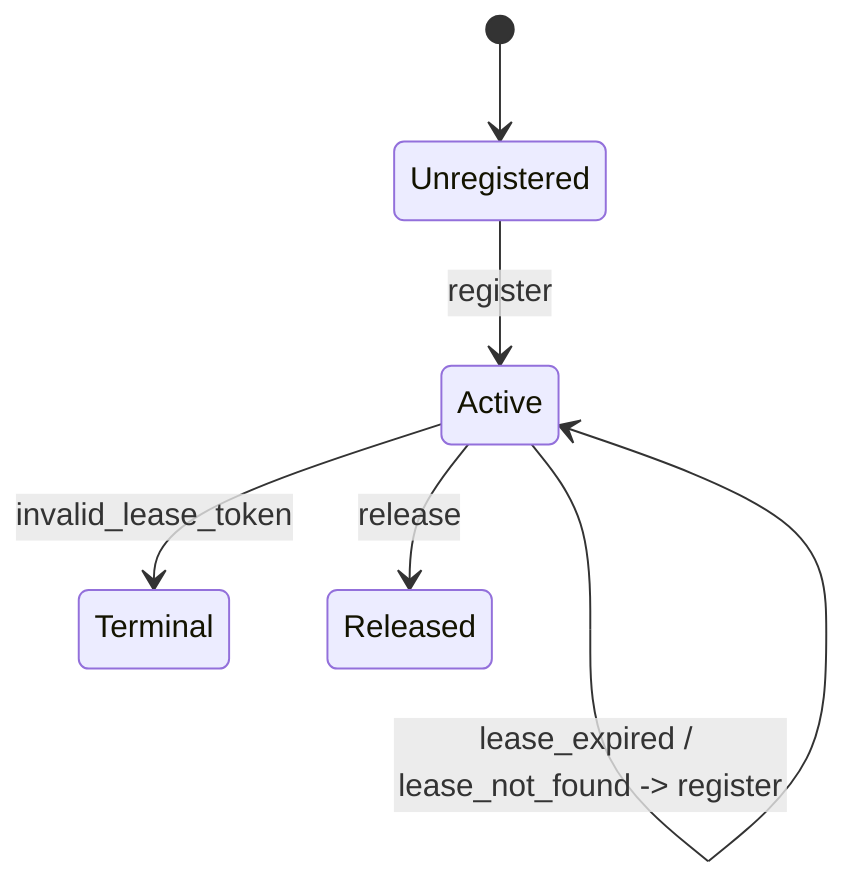
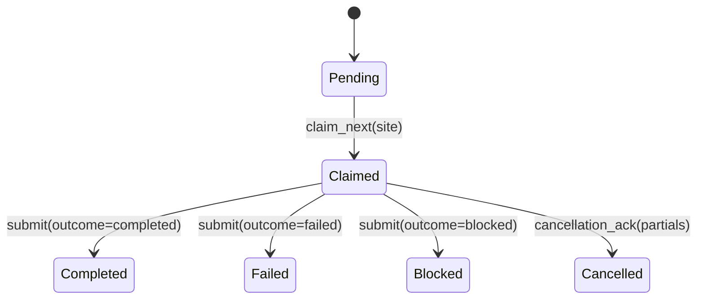

# gsv.run

`gsv.run` coordinates one site worker with a server-owned run queue.

## Lease Lifecycle

The heartbeat backoff tuple is fixed at `(5, 15, 30)` seconds.

## Run Lifecycle

`RunController` opens the observability bundle, restores/authenticates the
session, builds pacing with burst-cooldown cancellation checks, runs the visit
plan, submits the outcome, finalizes artifacts, and releases the lease.

## Cancellation

`CancellationMonitor.check(boundary=...)` is called by the visit runner at named
boundaries. Polling is debounced by `min_poll_interval_seconds`; `force=True`
overrides that debounce. When the server returns `cancel_requested=true`, the
monitor raises `RunCancellationRequested` with `partials`, and the controller
submits those partials through `cancellation_ack`.
